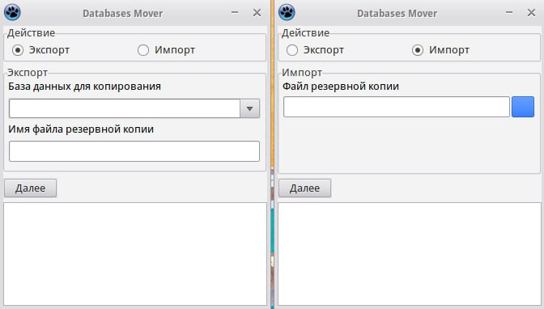

# EDUGIT
Сормачев Всеволод Алексеевич 351С
------------

# Пуш обновлённого ридми файла

# Разработка приложения для управление резервными копиями баз данных PostgreSQL - DataBases Mover

1. Написание  ***bash***-скриптов с использованием консольной утилиты **psql**. Параметры скрипты берут из текстового файла config.txt
	- Получение списка существующих баз данных;
	- Создание резервной копии базы данных;
	- Восстановление базы данных из резервной копии.
2. Разработка оконного приложения на **FreePascal** при помощи инструментов среды **Lazarus**, использующего ***bash***-скрипты.

# `bash-скрипты`

Получить список существующих баз данных:
```bash
#!/bin/bash

# Параметры из конфига
source "${1}/config.txt";

if [ -z "$user" ] || [ -z "$host" ]; then
    echo "Недостаточно параметров в config.txt (user или host)";
    exit 1;
fi;

# Построчный вывод всех баз данных
psql -U "$user" -h "$host" -l -t -q | cut -d \| -f 1 | grep -w -v -e postgres -e template0 -e template1 -e '^[[:space:]]*$'| sed 's/^[ \t]*//;s/[ \t]*$//';
```

Создание резервной копии базы данных:
```bash
#!/bin/bash

# Параметры из конфига
source "${3}/config.txt";

if [ -z "$user" ] || [ -z "$host" ] || [ -z "$port" ]; then
    echo "Недостаточно параметров в config.txt (user, host или port)";
    exit 1;
fi;

# Если база данных существует
if psql -U postgres -lqt | cut -d \| -f 1 | grep -wq "$1"; then
    # Копирование
    pg_dump -U "$user" -h "$host" -p "$port" -C "$1" > "${3}DBbackups/${2}".sql;

    if [ $? -eq 0 ]; then
	echo "Резервная копия базы данных создана";
    else
	echo "При создании резервной копии базы данных произошла ошибка";
	exit 1;
    fi;
else
    echo "База данных '$1' не найдена";
	exit 1;
fi;
```

Восстановление базы данных из резервной копии:
```bash
#!/bin/bash

# Параметры из конфига
source "$2/config.txt";

if [ -z "$user" ] || [ -z "$host" ] || [ -z "$port" ]; then
    echo "Недостаточно параметров в config.txt (user, host или port)";
    exit 1;
fi;

if [ ! -f "$1" ] || [[ "$1" != *.sql ]]; then
    echo "Файл отсутствует или не имеет расширение .sql";
    exit 1;
fi;

# Изъятие имени БД из 23 строки, 16 столбца
dbname=$(sed -n '23p' "$1" | cut -c 16- | awk '{print $1}');

# Существует ли база данных
if psql -U "$user" -h "$host" -l -t -q | cut -d \| -f 1 | grep -w -q "$dbname"; then # Поиск совпадений по всем базам данных
	# Имя для старой БД
    old_dbname="${dbname}_old_$(date +"%d.%m.%Y_%H:%M:%S")";
    echo -e "\n$dbname уже существует. Переименование $dbname в $old_dbname";
    
    # Переименовать старую БД
    psql -U "$user" -h "$host" -c "ALTER DATABASE \"$dbname\" RENAME TO \"$old_dbname\";";
fi;

#Восстановление базы данных
echo -e "\nВосстановление базы данных $dbname из [ $1 ]";

psql -U "$user" -h "$host" -f "$1";

if [[ $? -eq 0 ]]; then
    echo -e  "\nБаза данных восстановлена.";
else
    echo -e "\nПри восстановлении базы данных произошла ошибка.";
    exit 1;
fi;
```

# `Pascal функции`

Загрузить существующие базы данных в селект-меню:
```pascal
procedure TForm1.LoadDatabaseList(Sender: TObject);
var
  Process: TProcess;
  Output: TStringList;
  i: integer;
  Command: String;
begin
  Command := Format('"%sexistingDBs.sh" "%s"', [ProgramPath, ProgramPath]);

  Process := TProcess.Create(nil);
  Output := TStringList.Create;
  try
    Process.Executable := '/bin/bash';
    Process.Parameters.Add('-c');
    Process.Parameters.Add(Command);
    Process.Options := [poWaitOnExit, poUsePipes];
    Process.Execute;

    Output.LoadFromStream(Process.Output);

    // Заполнение селект-меню
    cmbDatabaseList.Items.Clear;
    for i := 0 to Output.Count - 1 do
      cmbDatabaseList.Items.Add(Output[i]);
  finally
    Output.Free;
    Process.Free;
  end;
end;
```

# Вид оконного приложения

